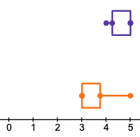
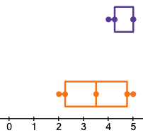
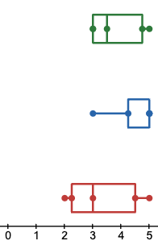

# Phase III: Prototypes and User Testing

## Introduction

In the last report, we concluded with Cognitive Walkthroughs and Informal Feedback, and we were wondering whether we could test our designs to ensure our product would be easy to use. The main goal of this sprint was to learn how to create and use prototypes as workable models of the extension and to gather data from participants.

## Methods

[Usability test protocol PDF!](protocol.pdf)

For this sprint, we explored one more method to gain a better understanding of what to improve for the extension: **User Tests**. To prepare for the User Tests, we had to complete several setup steps. First, we underwent training to conduct the tests effectively. Then, we created detailed protocols to guide the User Test sessions. Before starting, we also prepared consent forms for each participant to ensure we had their permission to take part.

To begin the sessions, we walked participants through the protocols and assured them that their names and any other private information would be shredded after the tests concluded. We then gathered background information from each participant before starting the tests.  We asked them to think-aloud as they worked through each task, and describe not only what they are doing, but why they are doing it. Each participant was asked to find a real tech product on both the prototype of our extension, and our competitor, Honey.  If they were able to complete that task, they were asked to continue by creating an alert for when that item would drop in price. During each session, we carefully observed and took notes on the steps the participant followed, confirming whether each step was successfully completed. After the tasks, we asked participants to rate our extension in comparison to the competitor's to help us identify areas for improvement.

## Findings

[Spreadsheet of our results!](https://docs.google.com/spreadsheets/d/13pTX2hT4gQKe3u2hVPQc0UNdrYdhTEd_dF8wrpG-Pyk/edit?usp=sharing)

From our user tests, we were able to get valuable user data and feature suggestions.  The previous experiences for the users with other price saving tools was generally negative, with most claiming they often wouldn’t work.  This shows that there is definitely a need for working apps like PriceCheck.  During the tests against competitor Honey, users identified major issues with the search engine’s ability.  All of the users had difficulties finding the item that they were supposed to, as the search results were specific enough to their search.  They found that they would have to search through results that seemed to not be arranged in any useful order.  After this, users also generally had difficulty recognizing Honey’s “Droplist” icon when setting an alert for the item.  Because of the lack of labeling to the icon, some users struggled to find it, with one third of users not being able to complete the task.  For both finding an item and creating an alert, users gave Honey a mean score of 3.5 out of 5.

When testing the PriceCheck’s prototype, users appreciated the simpler layout, which was shown by less confusion when navigating the app.  However, some users felt that the item page could have had more information in the item descriptions, such as prices and images of the listings.  Users also expressed that there could have been some confusion between the “Best Brand New Price” and “Best Price”, the latter of which would be more appropriate to call “Best Used Price”.  While creating an alert, one user pointed out that the current system doesn’t have an easy way to look for any price drop, and requires them to have the current price known to them already.  Overall, users gave PriceCheck’s both ease of use scores for finding an item and creating an alert a 4.7 out of 5.  During the debrief, when we asked users to compare PriceCheck to Honey, on average, users found that PriceCheck was a more efficient app, however, when rating satisfaction, there was a greater spread across the results, as some felt that Honey’s more informational item descriptions made them feel like they were getting the best prices.

Whisker plots for ease of use scores (out of 5) for finding an item, PriceCheck in purple and Honey in orange.

Whisker plots for ease of use scores for creating an alert.

Whisker plots for Pricecheck’s ease of use, efficiency, and satisfaction scores (out of 5) when compared to Honey.  Ease of use in green, efficiency in blue, and satisfaction in red.

## Conclusions

From the insights that the users were able to highlight the demand and potential for PriceCheck in the market of price-saving tools.  Users generally had negative experiences with competition in the field such as Honey, citing the weak search and unclear interface.  PriceCheck’s clear layout and simple design were beneficial to user interactions, and made navigation much easier for a newcomer to the app.  The comparison with Honey allowed for users to point out some valuable features missing from the app, such as displaying the prices and images of the listings on the item page, and modifying the alert creation to default at certain prices.  Future iterations of PriceCheck will have to take these features into consideration while also balancing the simplicity and efficiency focused design of the app.

## Caveats

Caveats for the PriceCheck user tests included the fact that it was not a fully developed application, which limited the amount of testing we could conduct, meaning the features that we would show such as the search would have to be assumed to work on the actual app. Another caveat was the small sample size of participants, a larger sample size would have been more optimal to get a more definitive range of opinions.  The diversity of this group was also limited to members of the UX class, which does not give a broad representation of PriceCheck's potential customers.
