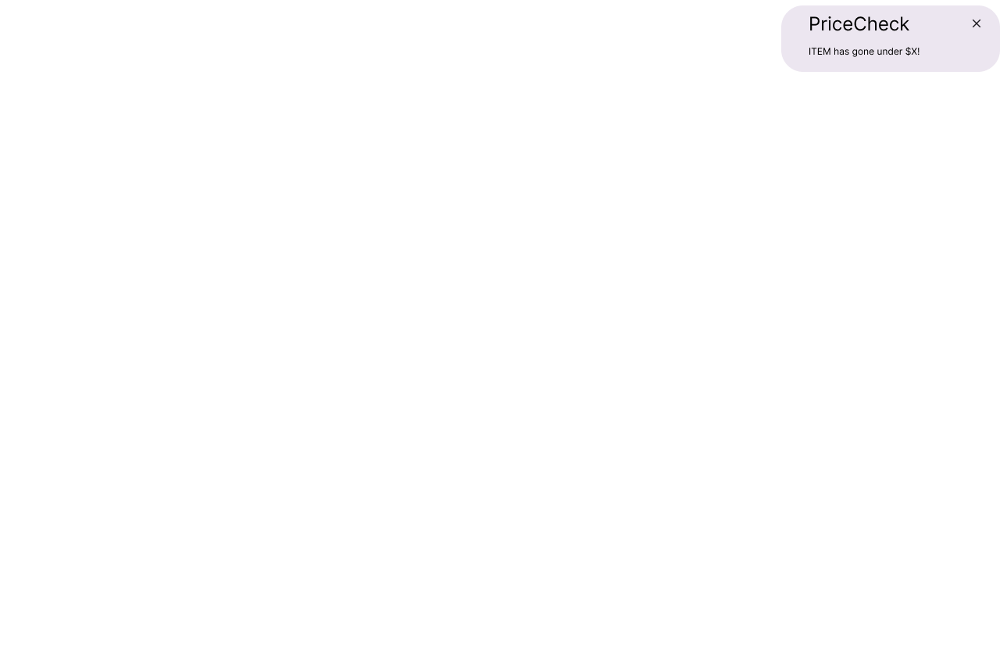
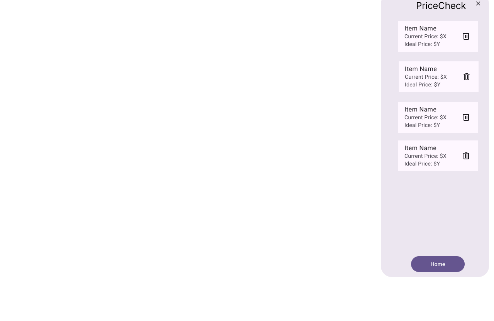
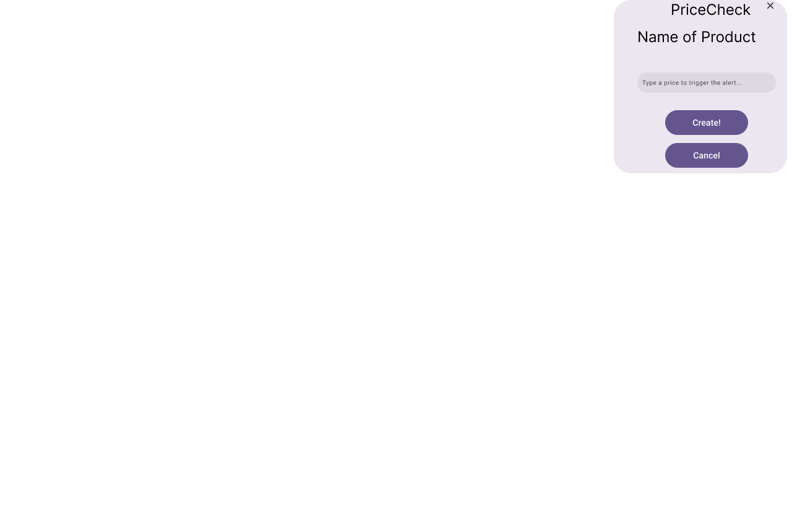
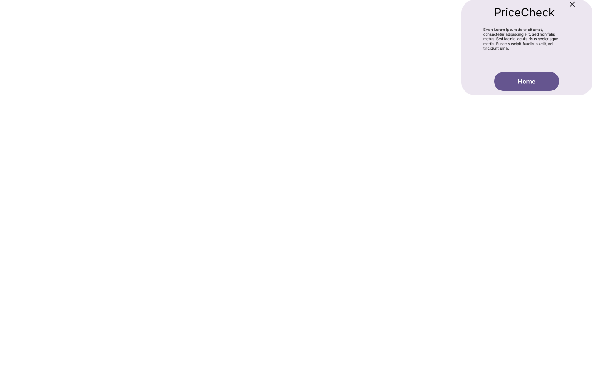
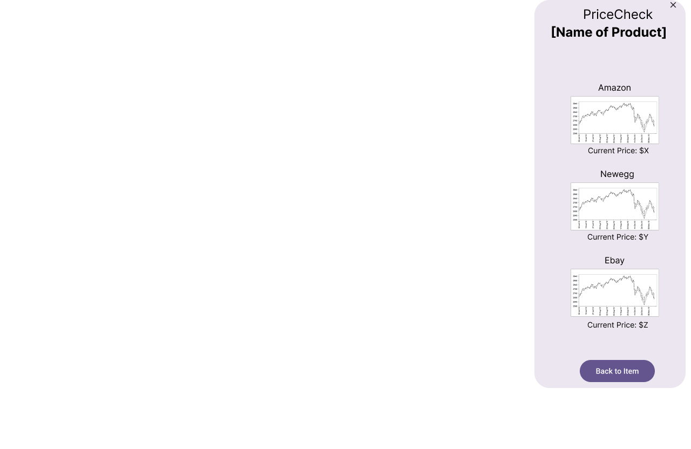
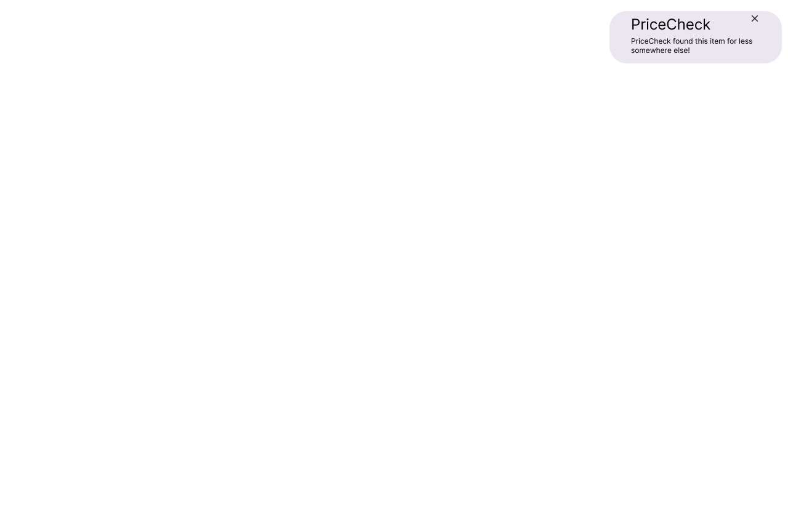
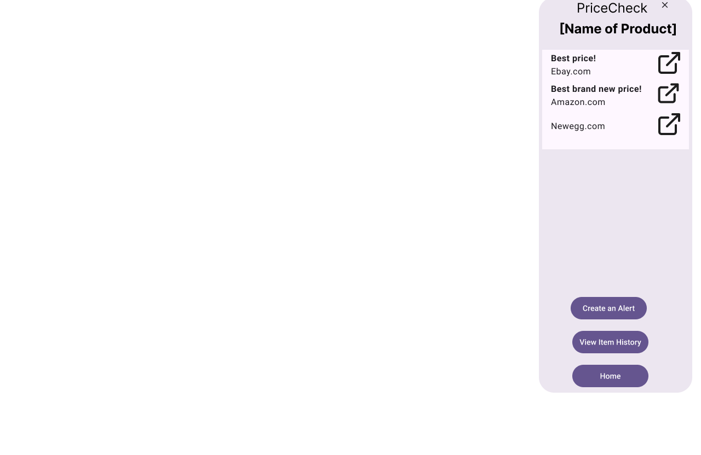

# Prototype

This is the screen that users see when one of their alerts are being set off.  They can close it or open the item page.

This is the alerts page, where users can manage their existing alerts.

The extension has been closed.

This is the alert creation page, where users can create alerts based on the item they were looking at.

This is the error page that handles any errors the users may run into.

This is the history page, where details over time are showed for the item.

This is the home page, which can be opened by opening the extension.

This is the notification users get when an item on the page is detected.  They can close it or open the item page.

This is the item page, where users can see the lowest prices online for an item, view the price history, or create an alert for them.
