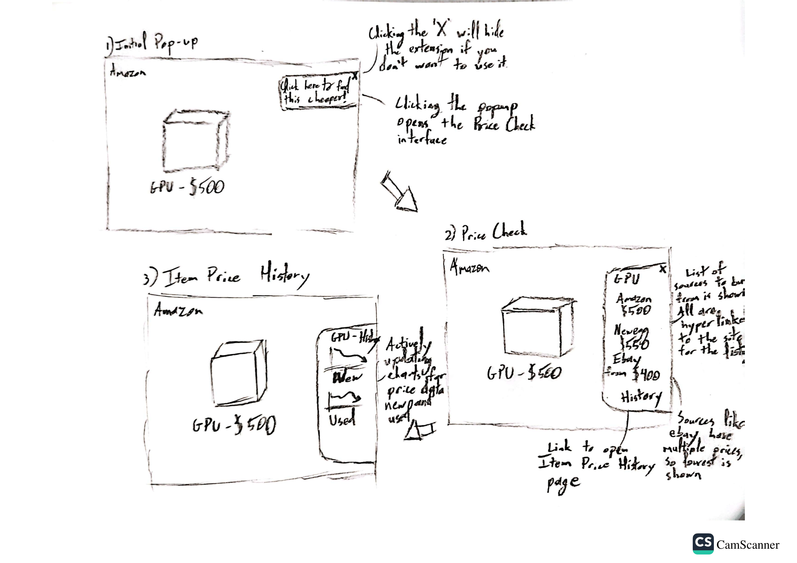

# Sketches

## PriceCheck Extension Flow

1. **Initial Pop-up**:  The extension first appears when it detects a "check-able" item.
2. **Price Check**:  After choosing to use the extension, the PriceCheck gives links to listings on all sites it can find the item available.
3. **Item Price History**:  The user can choose to view historic price trends on the item.
