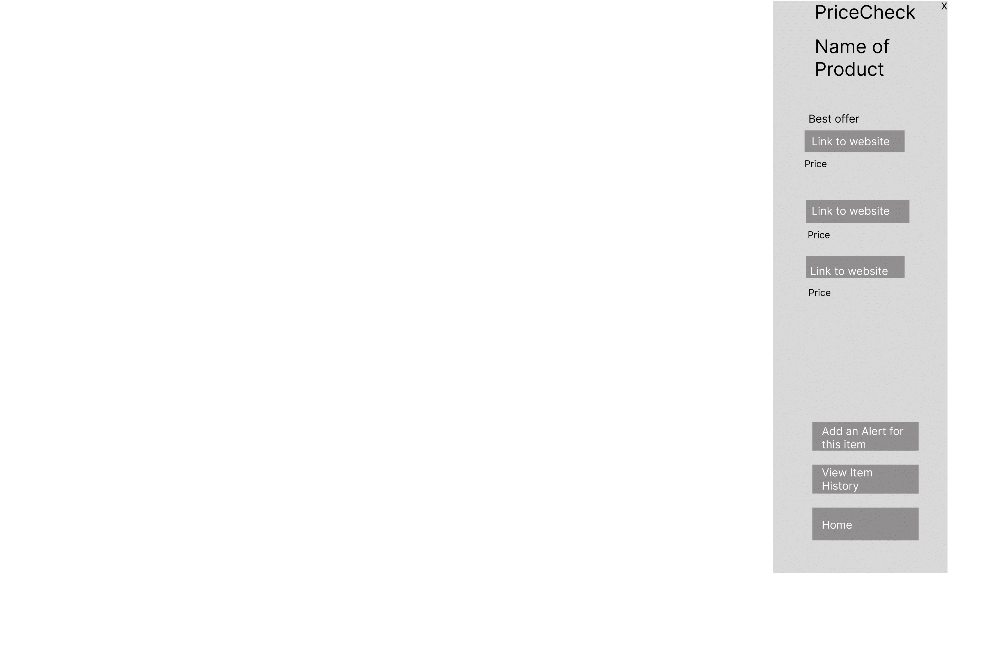
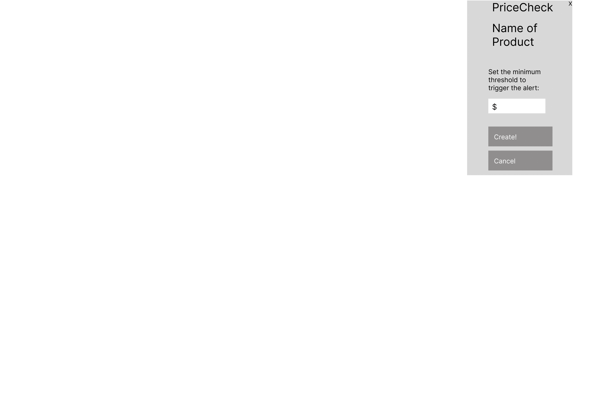
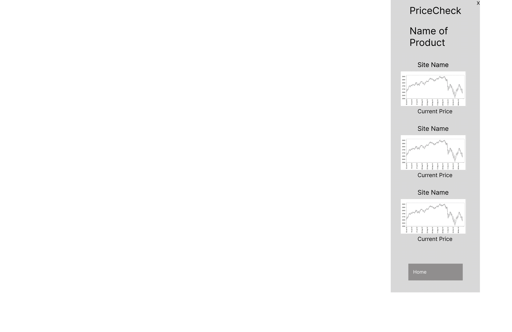
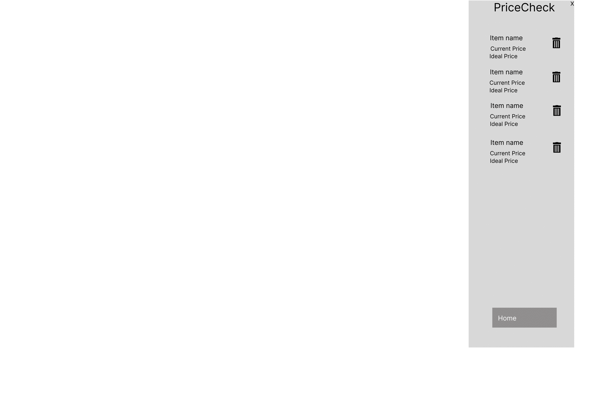

# Wireframes

This is a popup to tell the user that they can use PriceCheck.  It takes them directly to the pricechecker page for the item.

This is a popup to tell the user that an item on their alerts list is under the price they set.  It takes them directly to the pricechecker page for the item.

The home page for PriceCheck.  Users can search the current page with `Find Current Prices!`, search for other items with the search bar, check their alerts page in `My Alerts`, or activate dark mode.

The pricechecker page.  This is a list of websites where the item was found, with details on the website and price.  They can set an alert with `Add an Alert for this item` or check the history with `View Item History`.

This is the alert creation page.  The user sets the amount that they want PriceCheck to alert them for if their item goes under it.

The error page if something goes wrong at any point.

The history page for an item.  Shows charts of historic price over time.

This page shows all of the user's alerts that they have set, and allows them to delete them if they choose to.
